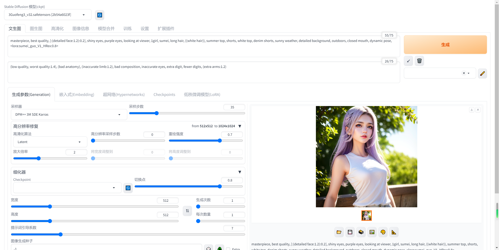

#### 本机硬件配置
- windows 10
- 显卡4070公版

#### 环境准备
- [Python 3.10.6 ](https://www.python.org/downloads/release/python-3106/)
- [git](https://git-scm.com/download/win)
- [模型库ControlNet](https://huggingface.co/lllyasviel/ControlNet/tree/main/models)

#### 开始安装
  1.克隆项目：`git clone https://github.com/AUTOMATIC1111/stable-diffusion-webui.git`

  2.运行`webui-user.bat` 非管理员权限运行

  3.把汉化包装一下[中文语言包](https://github.com/VinsonLaro/stable-diffusion-webui-chinese)
  
  4.[安装扩展](https://github.com/Mikubill/sd-webui-controlnet)

  5.下载模型库[国风模型](https://civitai.com/api/download/models/106289) 放到项目的`extensions/sd-webui-controlnet/models`文件下

  6.生成图片
  ```bash
  # 正向提示词
  masterpiece, best quality, [:(detailed face:1.2):0.2], shiny eyes, purple eyes, looking at viewer, 1girl, sumei, long hair, ((white hair)), summer top, shorts, white top, denim shorts, sunny weather, detailed background, outdoors, closed mouth, dynamic pose, <lora:sumei_guo_V1_HRex:0.8>
  # 负向提示词
  (low quality, worst quality:1.4), (bad anatomy), (inaccurate limb:1.2), bad composition, inaccurate eyes, extra digit, fewer digits, (extra arms:1.2)
  
```

#### [civitai.com更多玩法](civitai.com)
